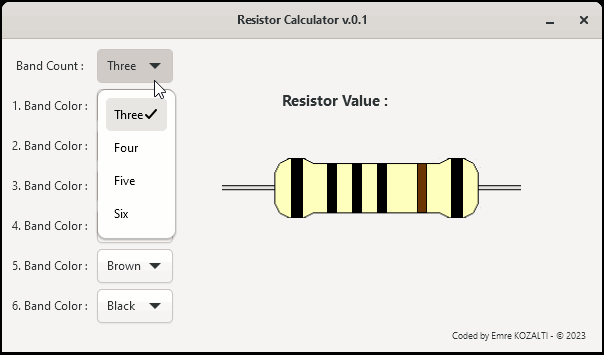

# Resistor Calculator Application
In electronics, classic resistors have colorful bands. For determine the resistor value you must solve the order of color on bands.

In this application, C and GTK4 are used for easy to calculate the order of colors.


## Dependencies
MSYS2 - GTK4
```
pacman -S mingw-w64-x86_64-gtk4
pacman -S mingw-w64-x86_64-pkg-config
```

## Install
```
make
```
or
```
gcc `pkg-config --cflags gtk4` -o run ./src/main.c ./src/calculate.c ./src/image.c `pkg-config --libs gtk4` -mwindows

```
## Sample


